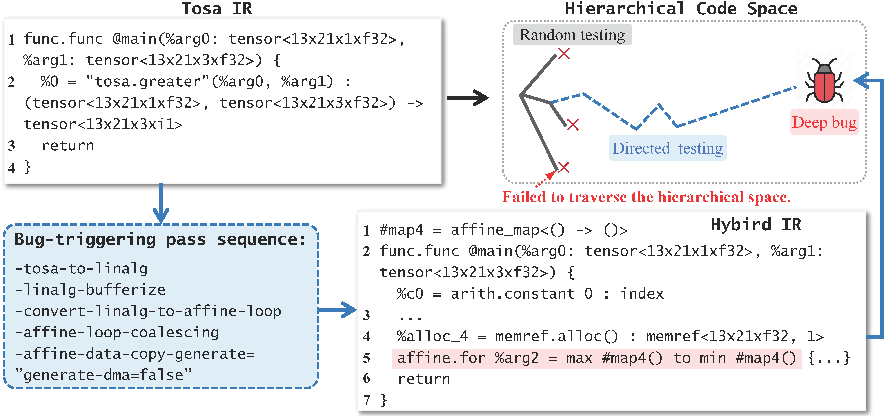

# Motivation example


<div align=center></div>
<div align=center>Figure 1: motivation example</div>

This document outlines the full motivating example of Figure 1. We had to simplify it in the paper due to space limit.


---
### Tosa IR:
The input tosa IR exposes a bug under a specific pass sequence.
```shell
  func.func @main(%arg0: tensor<13x21x1xf32>, %arg1: tensor<13x21x3xf32>) -> tensor<13x21x3xi1> {
    %0 = tosa.greater %arg0, %arg1 : (tensor<13x21x1xf32>, tensor<13x21x3xf32>) -> tensor<13x21x3xi1>
    return %0 : tensor<13x21x3xi1>
  }
```

---
### Bug-Triggering Pass Sequence：
The bug-triggering sequence is executed next. Execute the following command：
```shell
mlir-opt test.mlir -pass-pipeline="func.func(tosa-to-linalg)" | mlir-opt \
-linalg-bufferize  \
-convert-linalg-to-affine-loops \
-affine-loop-coalescing  \
-affine-data-copy-generate=generate-dma=false \
-lower-affine
```
---
### Hybird IR：
A Hybrid IR format is generated next, incorporating the affine loop structures. The resulting hybrid IR directly triggers a bug. In this hybrid MLIR program, a crash occurs when lowering its affine dialect using `-lower-affine` pass. The reason for this bug is the inaccurate calculations of lower and upper bounds in the `-affine-data-copy-generate=generate-dma=false` pass, resulting in empty loop bound maps `#map4 = affine_map<() -> ()>`. Hence, the MLIR compiler crashes when the "-lower-affine" pass works on an empty loop bound `affine.for %arg2 = max #map4() to min #map4()`.

The resulting hybird IR:
```shell
#map = affine_map<() -> (13)>
#map1 = affine_map<() -> (21)>
#map2 = affine_map<(d0)[s0] -> (d0 * s0)>
#map3 = affine_map<() -> (3)>
#map4 = affine_map<() -> ()>
#map5 = affine_map<(d0)[s0] -> (d0 mod s0)>
#map6 = affine_map<(d0)[s0] -> (d0 floordiv s0)>
module {
  func.func @main(%arg0: tensor<13x21x1xf32>, %arg1: tensor<13x21x3xf32>) -> tensor<13x21x3xi1> {
    %c819 = arith.constant 819 : index
    %c0 = arith.constant 0 : index
    %c819_0 = arith.constant 819 : index
    %c0_1 = arith.constant 0 : index
    %c273 = arith.constant 273 : index
    %c0_2 = arith.constant 0 : index
    %c0_3 = arith.constant 0 : index
    %0 = bufferization.to_memref %arg1 : memref<13x21x3xf32>
    %collapsed = tensor.collapse_shape %arg0 [[0], [1, 2]] : tensor<13x21x1xf32> into tensor<13x21xf32>
    %1 = bufferization.to_memref %collapsed : memref<13x21xf32>
    %alloc = memref.alloc() {alignment = 128 : i64} : memref<13x21x3xi1>
    %2 = affine.apply #map()
    %3 = affine.apply #map1()
    %4 = affine.apply #map2(%2)[%3]
    %5 = affine.apply #map3()
    %6 = affine.apply #map2(%4)[%5]
    %alloc_4 = memref.alloc() : memref<13x21xf32, 1>
    affine.for %arg2 = max #map4() to min #map4() {
      affine.for %arg3 = 0 to 21 {
        %8 = affine.load %1[%arg2, %arg3] : memref<13x21xf32>
        affine.store %8, %alloc_4[%arg2, %arg3] : memref<13x21xf32, 1>
      }
    }
    %alloc_5 = memref.alloc() : memref<13x21x3xf32, 1>
    affine.for %arg2 = max #map4() to min #map4() {
      affine.for %arg3 = 0 to 21 {
        affine.for %arg4 = 0 to 3 {
          %8 = affine.load %0[%arg2, %arg3, %arg4] : memref<13x21x3xf32>
          affine.store %8, %alloc_5[%arg2, %arg3, %arg4] : memref<13x21x3xf32, 1>
        }
      }
    }
    %alloc_6 = memref.alloc() : memref<13x21x3xi1, 1>
    affine.for %arg2 = 0 to %6 {
      %8 = affine.apply #map5(%arg2)[%5]
      %9 = affine.apply #map6(%arg2)[%5]
      %10 = affine.apply #map5(%9)[%3]
      %11 = affine.apply #map6(%9)[%3]
      %12 = affine.load %alloc_4[(%arg2 floordiv 3) floordiv 21, (%arg2 floordiv 3) mod 21] : memref<13x21xf32, 1>
      %13 = affine.load %alloc_5[(%arg2 floordiv 3) floordiv 21, (%arg2 floordiv 3) mod 21, %arg2 mod 3] : memref<13x21x3xf32, 1>
      %14 = arith.cmpf ogt, %12, %13 : f32
      affine.store %14, %alloc_6[(%arg2 floordiv 3) floordiv 21, (%arg2 floordiv 3) mod 21, %arg2 mod 3] : memref<13x21x3xi1, 1>
    }
    affine.for %arg2 = max #map4() to min #map4() {
      affine.for %arg3 = 0 to 21 {
        affine.for %arg4 = 0 to 3 {
          %8 = affine.load %alloc_6[%arg2, %arg3, %arg4] : memref<13x21x3xi1, 1>
          affine.store %8, %alloc[%arg2, %arg3, %arg4] : memref<13x21x3xi1>
        }
      }
    }
    memref.dealloc %alloc_6 : memref<13x21x3xi1, 1>
    memref.dealloc %alloc_5 : memref<13x21x3xf32, 1>
    memref.dealloc %alloc_4 : memref<13x21xf32, 1>
    %7 = bufferization.to_tensor %alloc : memref<13x21x3xi1>
    return %7 : tensor<13x21x3xi1>
  }
}
```